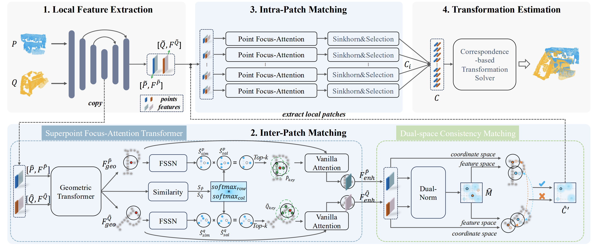

# Dual Focus-Attention Transformer for Robust Point Cloud Registration (CVPR2025)

PyTorch implementation of the paper: [Dual Focus-Attention Transformer for Robust Point Cloud Registration](https://openaccess.thecvf.com/content/CVPR2025/html/Fu_Dual_Focus-Attention_Transformer_for_Robust_Point_Cloud_Registration_CVPR_2025_paper.html).

[Kexue Fu](https://scholar.google.com/citations?hl=en&user=wRs-_DwAAAAJ&view_op=list_works&sortby=pubdate), [Mingzhi Yuan](https://scholar.google.com/citations?user=oheIjbUAAAAJ&hl=en&oi=ao), [Changwei Wang](https://scholar.google.com/citations?user=DnJKQI8AAAAJ&hl=en), Weiguang Pang, Jing Chi, [Manning Wang](https://scholar.google.com/citations?user=6I8hSp8AAAAJ&hl=en&oi=ao), [Longxiang Gao](https://scholar.google.com/citations?user=dYG_FfMAAAAJ&hl=en&oi=ao)

## Introduction

Recently, coarse-to-fine methods for point cloud registration have achieved great success, but few works deeply explore the impact of feature interaction at both coarse and  fine scales. By visualizing attention scores and correspondences, we find that existing methods fail to achieve effective feature aggregation at the two scales during the feature interaction. To tackle this issue, we propose a Dual FocusAttention Transformer framework, which only focuses on points relevant to the current point for feature interaction, avoiding interactions with irrelevant points. For the coarse scale, we design a superpoint focus-attention transformer guided by sparse keypoints, which are selected from the neighborhood of superpoints. For the fine scale, we only perform feature interaction between the point sets that belong to the same superpoint. Experiments show that our method achieve the state-of-the-art performance on three standard benchmarks. 



## News

2025.04: Code and pretrained model on 3DMatch/3DLoMatch release.

## Installation

Please use the following command for installation.

```bash
# It is recommended to create a new environment
conda create -n dfat python==3.8
conda activate dfat

# [Optional] If you are using CUDA 11.8 or newer, please install `torch==2.4.0+cu118`
conda install pytorch==2.4.0 torchvision==0.19.0 torchaudio==2.4.0  pytorch-cuda=11.8 -c pytorch -c nvidia

# Install packages and other dependencies
pip install -r requirements.txt
python setup.py build develop

# PointNet++
pip install "git+https://gitee.com/Fukexue/Pointnet2_PyTorch.git#egg=pointnet2_ops&subdirectory=pointnet2_ops_lib"

# GPU kNN
pip install --upgrade https://github.com/unlimblue/KNN_CUDA/releases/download/0.2/KNN_CUDA-0.2-py3-none-any.whl
```

Code has been tested with Ubuntu 22.04 Torch 2.4.0.

## Pre-trained Weights

We provide pre-trained weights in the [release](https://github.com/fukexue/DFAT/releases/tag/weight) page. Please download the latest weights and put them in `output` directory.

## 3DMatch

### Data preparation

The dataset can be downloaded from [PREDATOR](https://github.com/prs-eth/OverlapPredator). The data should be organized as follows:

```text
--data--3DMatch--metadata
              |--data--train--7-scenes-chess--cloud_bin_0.pth
                    |      |               |--...
                    |      |--...
                    |--test--7-scenes-redkitchen--cloud_bin_0.pth
                          |                    |--...
                          |--...
```

### Training

The code for 3DMatch is in `experiments/3DMatch`. Use the following command for training.

```bash
python trainval.py
```

### Testing

Use the following command for testing.

```bash
# 3DMatch
python test.py --cfg config.yaml --snapshot=download_weight_path/your_weight_path --benchmark=3DMatch --note_name release
python eval.py --cfg config.yaml --benchmark=3DMatch --method=lgr --note_name you_note_text
# 3DLoMatch
python test.py --cfg config.yaml --snapshot=download_weight_path/your_weight_path --benchmark=3DLoMatch --note_name release
python eval.py --cfg config.yaml --benchmark=3DLoMatch --method=lgr --note_name you_note_text
```

We also provide pretrained weights in `output`, use the following command to test the pretrained weights.

```bash
# 3DMatch
python test.py --cfg config.yaml --snapshot=download_weight_path --benchmark=3DMatch --note_name release
python eval.py --cfg config.yaml --benchmark=3DMatch --method=lgr --note_name release
# 3DLoMatch
python test.py --cfg config.yaml --snapshot=download_weight_path --benchmark=3DLoMatch --note_name release
python eval.py --cfg config.yaml --benchmark=3DLoMatch --method=lgr --note_name release
```

For `DFAT+PEAL`, you can use the `output/3DMatch_release/geo_prior`(First, run DFAT.) folder as the input for PEAL. Please refer to [PEAL](https://github.com/Gardlin/PEAL) for how to run it.

## Citation

```bibtex
@inproceedings{fu2025dual,
  title={Dual Focus-attention Transformer for Robust Point Cloud Registration},
  author={Fu, Kexue and Yuan, Mingzhi and Wang, Changwei and Pang, Weiguang and Chi, Jing and Wang, Manning and Gao, Longxiang},
  booktitle={Proceedings of the IEEE/CVF Conference on Computer Vision and Pattern Recognition},
  pages={11769--11778},
  year={2025}
}
```

## Acknowledgements

- [D3Feat](https://github.com/XuyangBai/D3Feat.pytorch)
- [PREDATOR](https://github.com/prs-eth/OverlapPredator)
- [RPMNet](https://github.com/yewzijian/RPMNet)
- [CoFiNet](https://github.com/haoyu94/Coarse-to-fine-correspondences)
- [huggingface-transformer](https://github.com/huggingface/transformers)
- [SuperGlue](https://github.com/magicleap/SuperGluePretrainedNetwork)
- [GeoTransformer](https://github.com/qinzheng93/GeoTransformer)
